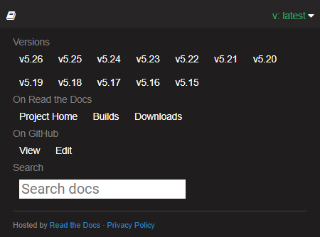

<h3 style="margin-bottom:1.25em;">User Guides</h3>

User guides are available via the left navigation. 

For this release, guides are available in PDF format. 

(From version 5.26 onwards, guides are available in both PDF and HTML (Markdown) formats.) 

<h3> User Guides for Other Versions</h3>

To access user guides for other versions of the software, click the small flyout menu banner in the bottom right of the website:

Clicking the banner opens a pane with a link to all the other versions.

